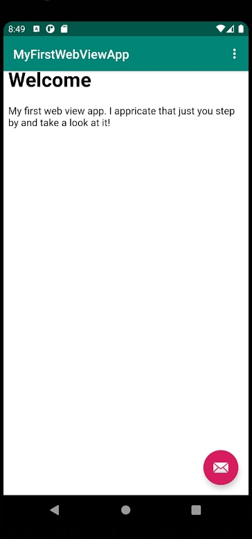

I kodstycket nedan så skapas det en ny web view som identifierar ett sätt att öppna
hemsidor på i appen. Detta gör så att vi kan använda oss av både internal och external hemsidor för
att visa de i appen som byggts.

```
<WebView
        android:id="@+id/my_webview"
        android:layout_width="match_parent"
        android:layout_height="match_parent"
        android:layout_marginTop="30dp" />
```

Nedan i första delen av kodstycket så använder vi oss av web viewn som skapats och kopplar ihop de
via id my_webview. Appen vet då vad den ska använda sig av för funktion för att visa en hemsida i
appen. I andra delen av kodstycket så använder vi oss av en egen web client vilket då gör att när
vi besöker en external hemsida så går det ej att skriva in en egen URL utan det går endast att
navigera på den hemsidan som besöks. I bilden under koden så ser vi att det ej finns något URL-fält
vilket gör då att användaren ej fritt kan besöka andra hemsidor.

```
myWebView = findViewById(R.id.my_webview);
WebSettings webSettings = myWebView.getSettings();
webSettings.setJavaScriptEnabled(true);

WebViewClient MyWebViewClient = new WebViewClient();
myWebView.setWebViewClient(MyWebViewClient);
```


I vår meny i appen går det att besöka en external och en internal hemsida. I koden nedan så finns
det två if-satser där det generar olika kod beroende på vilken av de två sidorna man vill besöka.
I if-satserna så hänvisar de till en funktion som ska köras när respektive knapp trycks på. När
den external hemsidan ska visas så körs den första funktionen där den då laddar en URL som i detta
fallet är https://his.se vilket gör att användaren kommer in på his.se via appen. Hemsidan öppnas
inte i en ny browser utan stannar kvar i appen. När användaren öppnar internal hemsida så laddas
en URL in som hänvisar att html-dokumentet befinner sig i en specifik mapp. Under koden kan vi se
bilder på först den interna hemsidan och sedan den externa hemsidan.

```
if (id == R.id.action_external_web) {
    Log.d("==>", "Will display external web page");
    showExternalWebPage();
    return true;
}

if (id == R.id.action_internal_web) {
    Log.d("==>", "Will display internal web page");
    showInternalWebPage();
    return true;
}

public void showExternalWebPage() {
    myWebView.loadUrl("https://his.se");
}

public void showInternalWebPage() {
    myWebView.loadUrl("file:///android_asset/index.html");
}
```



